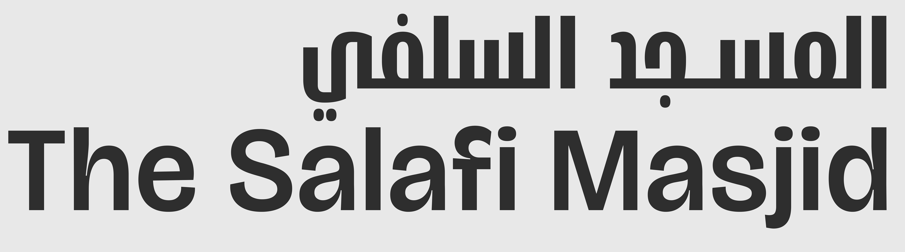

<h1 align="center">
  <br>
  <sub>بسم الله الرحمن الرحيم</sub>
  <br><br>
  
  <br><br>
  Mosque Connect
  <br>
  <sup><sub>صِلَة المسجد</sub></sup>
</h1>

<p align="center">
  <em>A serene, premium mobile experience for local mosque communities.</em>
  <br>
  <em>Prayer times &middot; Announcements &middot; Events &middot; Donations &middot; One beautiful app.</em>
</p>

<p align="center">
  
  
  
  
  
  
</p>

<p align="center">
  <code>god-tier, not SaaS</code> — rooted in Islamic geometric art and calligraphic tradition
</p>

---

## The Vision

Most mosque apps feel like an afterthought — generic Material UI shells with hardcoded prayer times and clip-art minarets. **Mosque Connect** is different.

The design language draws from the **"Timeless Sanctuary"** philosophy: warm stone-toned backgrounds inspired by masjid marble, deep Sapphire blues echoing midnight in the musalla, and Divine Gold accents reminiscent of gilded Quranic manuscripts. Animations breathe with spring physics, never the harsh linearity of factory software.

The gradient _is_ the data — calibrated to real sky tones so a returning user recognises the prayer window by colour alone, like recognising golden hour without checking a clock.

This is an app your community _deserves_.

---

## Features

<table>
<tr>
<td width="50%" valign="top">

### Prayer Times &middot; أوقات الصلاة
- Aladhan API (primary) with adhan-js offline fallback
- Next prayer countdown with scale pulse animation
- GPU-rendered atmospheric gradients per prayer window
- Hijri date display alongside Gregorian
- Mosque-specific jama'ah times from scraped timetables
- Date navigation with horizontal swipe

</td>
<td width="50%" valign="top">

### Announcements &middot; الإعلانات
- Feed via Django REST API with pull-to-refresh
- Three priority levels: Normal, Urgent, Janazah
- Janazah announcements with dignified gold styling
- Read/unread tracking with Divine Gold badges
- Time-grouped sections (Today / This Week / Earlier)

</td>
</tr>
<tr>
<td width="50%" valign="top">

### Events & Lessons &middot; الفعاليات والدروس
- 6 category filters (Lesson, Lecture, Quran School, Youth, Sisters, Community)
- Speaker, time, location, recurring indicators
- Calendar integration — add events to device calendar
- Pagination with infinite scroll

</td>
<td width="50%" valign="top">

### Donations &middot; التبرعات
- Stripe integration (one-time and monthly)
- HMRC Gift Aid support (25% boost)
- Cover processing fees option
- Bank transfer details with copy-to-clipboard
- Rotating hadith cards for spiritual encouragement

</td>
</tr>
<tr>
<td width="50%" valign="top">

### Admin &middot; لوحة الإدارة
- In-app Quick Post for announcements and events
- 3-step event creation wizard (Basics > Date & Time > Details)
- Preview before publishing
- Non-technical-admin-first: zero jargon, 60s to first post
- Django admin with Unfold theme (Sacred Blue brand)

</td>
<td width="50%" valign="top">

### Settings &middot; الإعدادات
- GPS location detection for accurate prayer times
- 15 calculation methods supported
- Prayer reminder timing (at athan, 5/10/15/30 min before)
- 12h/24h format, light/dark/system theme
- Full RTL support for Arabic
- Bug reporting and feature request forms

</td>
</tr>
</table>

---

## Design System

> _"Geometry is the language in which God has written the universe."_

### Palette — "Timeless Sanctuary" (Jewel & Stone Philosophy)

```
  Light — "Morning Light in the Musalla"
  ┌─────────────────────────────────────────────────────────────┐
  │                                                             │
  │   ██████  Stone-100       #F9F7F2   Main background         │
  │   ██████  Onyx-900        #121216   Primary text             │
  │   ██████  Sapphire-700    #0F2D52   Brand primary tint       │
  │   ██████  Divine Gold     #A68523   Accent, prayer active    │
  │   ██████  Sage-600        #2D6A4F   Success states           │
  │   ██████  Crimson-600     #B91C1C   Urgent/Janazah alert     │
  │                                                             │
  │                                                             │
  │   Dark — "Midnight in the Masjid"                           │
  │   ██████  Sapphire-950    #0A1628   Main background          │
  │   ██████  Snow            #F5F5F7   Primary text             │
  │   ██████  Sapphire-400    #6BABE5   Brand tint               │
  │   ██████  Gold Bright     #F0D060   Accent (dark contrast)   │
  │                                                             │
  └─────────────────────────────────────────────────────────────┘
```

All RGBA values are centralized in the `alpha` token system in `Colors.ts` — no hardcoded rgba anywhere in components.

### Typography — Apple HIG Type Scale

System fonts (SF Pro / Roboto) with weight variation. No custom font loading needed.

| Style | Size | Weight | Usage |
|-------|------|--------|-------|
| `largeTitle` | 34 | Bold | Screen headers |
| `title1` | 28 | Bold | Section titles |
| `headline` | 17 | Semibold | Active prayer, row labels |
| `body` | 17 | Regular | Default text |
| `prayerCountdown` | 54 | Ultralight | Main countdown timer |
| `prayerName` | 40 | Light | Hero prayer name |
| `sectionHeader` | 13 | Semibold | Uppercase section labels |
| `caption1` | 12 | Regular | Metadata, timestamps |

### Spacing — 8pt Grid

```
  2xs ·     2px    Hairline gaps
  xs  ··    4px    Inline icon gaps
  sm  ···   8px    Tight element spacing
  md  ····  12px   Default padding
  lg  ····· 16px   Row padding
  xl  ······ 20px  Card padding
  2xl ······· 24px Section spacing
  3xl ········ 32px Screen-edge insets
  4xl ········· 48px Major visual breaks
```

### Elevation — Apple Convention

Light mode uses black shadows. Dark mode uses sapphire hairline borders (shadows invisible on dark backgrounds).

### Animation — Spring Physics Only

Three spring presets via Reanimated: `gentle`, `snappy`, `bouncy`. No linear easing anywhere. Prayer transitions include scale pulse + gold overlay flash + haptic feedback.

---

## Architecture

```
                    ┌──────────────────────────┐
                    │     Digital Ocean         │
                    │                           │
                    │  ┌────────────────────┐   │
                    │  │   Django 5 + DRF   │   │
                    │  │   ─────────────    │   │
                    │  │   PostgreSQL       │   │
                    │  │   Token Auth       │   │
                    │  │   Stripe Webhooks  │   │
                    │  │   Unfold Admin     │   │
                    │  │   Sentry SDK       │   │
                    │  └────────┬───────────┘   │
                    │           │ :8000          │
                    └───────────┼────────────────┘
                                │
                        HTTPS   │   Let's Encrypt
                                │
              ┌─────────────────┴──────────────────┐
              │          Mosque Connect App          │
              │                                      │
              │  ┌────────┐ ┌────────┐ ┌──────────┐ │
              │  │ Prayer │ │ Announ │ │  Events  │ │
              │  │ Times  │ │ cements│ │ /Lessons │ │
              │  └───┬────┘ └───┬────┘ └────┬─────┘ │
              │      │          │           │        │
              │  ┌───┴──────────┴───────────┴─────┐ │
              │  │       Service Layer             │ │
              │  │                                 │ │
              │  │  Aladhan API  → Prayer Times    │ │
              │  │  adhan-js     → Offline Calc    │ │
              │  │  Django API   → Data (REST)     │ │
              │  │  Stripe       → Donations       │ │
              │  │  AsyncStorage → Offline Cache   │ │
              │  │  Expo Notifs  → Reminders        │ │
              │  │  Sentry       → Error Tracking  │ │
              │  └─────────────────────────────────┘ │
              └──────────────────────────────────────┘
```

---

## Tech Stack

| Layer | Choice | Why |
|-------|--------|-----|
| **Framework** | React Native + Expo SDK 55 | Single codebase, managed workflow, OTA updates |
| **Navigation** | Expo Router | File-based routing, deep links, typed routes |
| **Backend** | Django 5 + DRF | PostgreSQL, token auth, Unfold admin UI |
| **Prayer Times** | Aladhan API + adhan-js | API primary + Hijri dates; local calc when offline |
| **Payments** | Stripe | Checkout sessions, webhooks, recurring donations |
| **Notifications** | Expo Notifications | Abstracts FCM/APNs, local scheduling |
| **Storage** | AsyncStorage | Offline-first caching (7-day stale cap) |
| **Animations** | Reanimated | 60fps spring physics on the UI thread |
| **GPU Graphics** | @shopify/react-native-skia | Atmospheric gradients, Islamic patterns |
| **Haptics** | expo-haptics | Meaningful interaction feedback |
| **Error Tracking** | @sentry/react-native | PII scrubbing, error boundaries |
| **i18n** | i18next + react-i18next | English + Arabic, full RTL support |
| **Dates** | date-fns | Lightweight, tree-shakeable formatting |
| **Language** | TypeScript (strict) | Zero `any` types, full inference |

---

## Project Structure

```
mosque-connect/
├── app/                          # Expo Router — file-based screens
│   ├── _layout.tsx               # Root layout (Sentry, themes, fonts)
│   ├── +not-found.tsx            # 404 screen (localized)
│   ├── (auth)/                   # Auth flow
│   │   ├── welcome.tsx           # Welcome screen with social auth
│   │   ├── sign-in.tsx           # Email sign in
│   │   └── sign-up.tsx           # Email registration
│   └── (tabs)/                   # Bottom tab navigator
│       ├── _layout.tsx           # Tab bar (error boundary wrapped)
│       ├── index.tsx             # Prayer Times (home)
│       ├── announcements.tsx     # Community announcements
│       ├── community.tsx         # Community hub
│       ├── events.tsx            # Events & lessons
│       ├── support.tsx           # Donations (Stripe + bank transfer)
│       └── settings.tsx          # Preferences & mosque selection
│
├── components/
│   ├── brand/                    # Brand identity
│   │   ├── SkiaAtmosphericGradient.tsx  # GPU-rendered sky gradients
│   │   ├── IslamicPattern.tsx    # Geometric tile overlay
│   │   ├── SolarLight.tsx        # Directional sunlight effect
│   │   ├── GlowDot.tsx           # Prayer active indicator
│   │   └── GoldBadge.tsx         # Divine Gold notification badge
│   ├── ui/                       # Design system primitives
│   │   ├── Button.tsx            # 4 variants: primary/secondary/ghost/destructive
│   │   ├── BottomSheet.tsx       # Spring-animated sheets (replaces modals)
│   │   ├── TextInput.tsx         # Themed text input
│   │   └── ListRow.tsx           # Apple HIG list row
│   ├── admin/                    # Admin components
│   │   ├── QuickPostSheet.tsx    # Announcement creation
│   │   ├── EventFormSheet.tsx    # 3-step event wizard
│   │   └── AdminFAB.tsx          # Floating action button
│   ├── prayer/                   # Prayer-specific components
│   └── navigation/               # Tab bar customizations
│
├── lib/                          # Core services
│   ├── api.ts                    # Django REST client (token auth, retry)
│   ├── prayer.ts                 # Aladhan API + adhan-js fallback
│   ├── prayerGradients.ts        # Sky-calibrated gradient mapping
│   ├── notifications.ts          # Push tokens, prayer reminders
│   ├── storage.ts                # AsyncStorage cache (7-day stale cap)
│   ├── i18n.ts                   # i18next initialization
│   └── layoutGrid.ts             # Layout constants
│
├── hooks/                        # React hooks
│   ├── usePrayerTimes.ts         # Prayer data, countdown, Hijri date
│   ├── useAnnouncements.ts       # Paginated feed + pull-to-refresh
│   └── useEvents.ts              # Events + category filtering
│
├── contexts/                     # React Context providers
│   ├── AuthContext.tsx            # Auth state, social login, guest mode
│   └── ThemeContext.tsx           # Theme (light/dark/system)
│
├── constants/
│   ├── Colors.ts                 # Palette + semantic tokens + alpha system
│   ├── Theme.ts                  # Spacing, elevation, typography, springs
│   └── locales/
│       ├── en.json               # English translations (500+ keys)
│       └── ar.json               # Arabic translations (500+ keys)
│
├── backend/                      # Django REST API
│   ├── config/                   # Settings, URLs, middleware
│   ├── core/                     # Models, admin, migrations
│   ├── api/                      # Serializers, views, URLs
│   ├── Dockerfile                # Multi-stage production build
│   └── gunicorn.conf.py          # 2 workers, 30s timeout
│
├── CLAUDE.md                     # AI development conventions
├── DOCTRINE.md                   # Non-negotiable project rules
└── .github/workflows/            # CI: TypeScript, ESLint, Jest, Django tests
```

---

## Getting Started

### Prerequisites

- [Node.js](https://nodejs.org/) 18+
- [Expo CLI](https://docs.expo.dev/get-started/installation/) (`npx expo`)
- iOS Simulator (macOS) or Android Emulator, or Expo Go on a physical device

### Installation

```bash
# Clone the repository
git clone https://github.com/Masjid-Connect/Masjid-Connect.git
cd Masjid-Connect

# Install dependencies
npm install

# Copy environment config
cp .env.example .env
```

### Development

```bash
# Start the dev server
npx expo start

# Or target a specific platform
npx expo start --ios
npx expo start --android

# Clear cache if needed
npx expo start --clear
```

### Backend

```bash
cd backend
pip install -r requirements.txt
python manage.py migrate
python manage.py seed_data            # Seed sample data
python manage.py createsuperuser
python manage.py runserver            # http://localhost:8000
```

### Quality Checks

```bash
npm run typecheck                     # TypeScript strict mode
npm run lint                          # ESLint + Prettier
npm test                              # Jest test suite
cd backend && python manage.py test   # Django tests
```

---

## Environment Variables

| Variable | Description | Required |
|----------|-------------|----------|
| `EXPO_PUBLIC_API_URL` | Django REST API base URL | Yes |
| `EXPO_PUBLIC_GOOGLE_CLIENT_ID` | Google OAuth client ID | For Google sign-in |
| `EXPO_PUBLIC_SENTRY_DSN` | Sentry DSN for error tracking | Production |
| `STRIPE_SECRET_KEY` | Stripe API key (backend) | For donations |
| `STRIPE_WEBHOOK_SECRET` | Stripe webhook signing secret (backend) | For donations |

---

## Prayer Time Calculation

Mosque Connect uses a two-tier approach to ensure prayer times are always available:

```
  ┌─────────────────────────────────────────────────┐
  │  1. Aladhan API  (PRIMARY — always preferred)   │
  │     GET /v1/timings/{date}                      │
  │     ?latitude={lat}&longitude={lng}&method={m}  │
  │     → Accurate times + Hijri date               │
  │     → Free, no API key required                 │
  ├─────────────────────────────────────────────────┤
  │  2. adhan-js     (OFFLINE FALLBACK ONLY)        │
  │     Local calculation from GPS coordinates      │
  │     → Used only when network is unavailable     │
  │     → Never used as primary source              │
  ├─────────────────────────────────────────────────┤
  │  3. Mosque Timetable  (JAMA'AH OVERLAY)         │
  │     MosquePrayerTime model — scraped from PDFs  │
  │     → Congregation times set by the mosque      │
  │     → Displayed alongside calculated start time │
  └─────────────────────────────────────────────────┘
```

**15 supported calculation methods** including ISNA, MWL, Umm Al-Qura, Egyptian, Karachi, Gulf Region, Turkey, and more.

---

## Offline-First Philosophy

> _The app should work in a basement with no signal just as well as on fiber._

1. **Prayer times** — Aladhan API primary, adhan-js offline fallback. Cached in AsyncStorage.
2. **Cache everything** — Announcements and events stored with timestamps.
3. **7-day stale cap** — `allowStale` mode serves cached data but never older than 7 days.
4. **Stale is better than empty** — Show cached data with "Last updated" indicator.
5. **Queue and sync** — Subscription changes queue locally, sync when connectivity returns.

---

## API Documentation

The backend provides interactive API documentation:

| URL | Description |
|-----|-------------|
| `/api/schema/` | OpenAPI 3.0 schema (YAML) |
| `/api/docs/` | Swagger UI (interactive explorer) |
| `/admin/` | Django admin panel (Unfold theme) |
| `/health/` | Health check (verifies DB connectivity) |

See [CLAUDE.md](./CLAUDE.md) for the complete API endpoint reference.

---

## Design Principles

| Principle | Implementation |
|-----------|---------------|
| **God-tier, not SaaS** | No generic Material/iOS chrome. Custom Islamic aesthetic. |
| **Stone substrate** | Warm `#F9F7F2` backgrounds. Sapphire midnight dark mode. |
| **Divine Gold, not red** | Notification badges are gold. GoldBadge auto-adapts to dark mode. |
| **Breathe** | 32px screen-edge insets. Generous whitespace throughout. |
| **Spring physics** | Reanimated springs (`gentle`, `snappy`, `bouncy`). Never linear. |
| **Atmospheric gradients** | GPU-rendered sky tones encode prayer time data visually. |
| **Haptic vocabulary** | Light tap for nav, medium for prayer transition, heavy for urgent. |
| **RTL-native** | Built for Arabic from day one. Layouts flip automatically. |
| **Offline-first** | Aladhan API primary, adhan-js fallback. Always functional. |
| **Admin-friendly** | Non-technical imams can post announcements in 60 seconds. |
| **Accessible** | 44pt touch targets, WCAG AA contrast, screen reader labels. |

---

## Contributing

Contributions are welcome and deeply appreciated. Whether you're fixing a typo or building a major feature, you're helping mosques serve their communities better.

```bash
# Create a feature branch
git checkout -b feature/your-feature-name

# Make your changes, then
npm run typecheck                 # Ensure no type errors
npm run lint                      # Ensure code quality
npm test                          # Run test suite
git commit -m "Add meaningful description"
git push origin feature/your-feature-name
```

Please read [CLAUDE.md](./CLAUDE.md) for code conventions and [DOCTRINE.md](./DOCTRINE.md) for non-negotiable project rules.

---

## License

MIT — free for all mosques, everywhere.

---

<p align="center">
  <sub>Built with care for the ummah</sub>
  <br>
  <sub>اللهم تقبل منا</sub>
</p>
