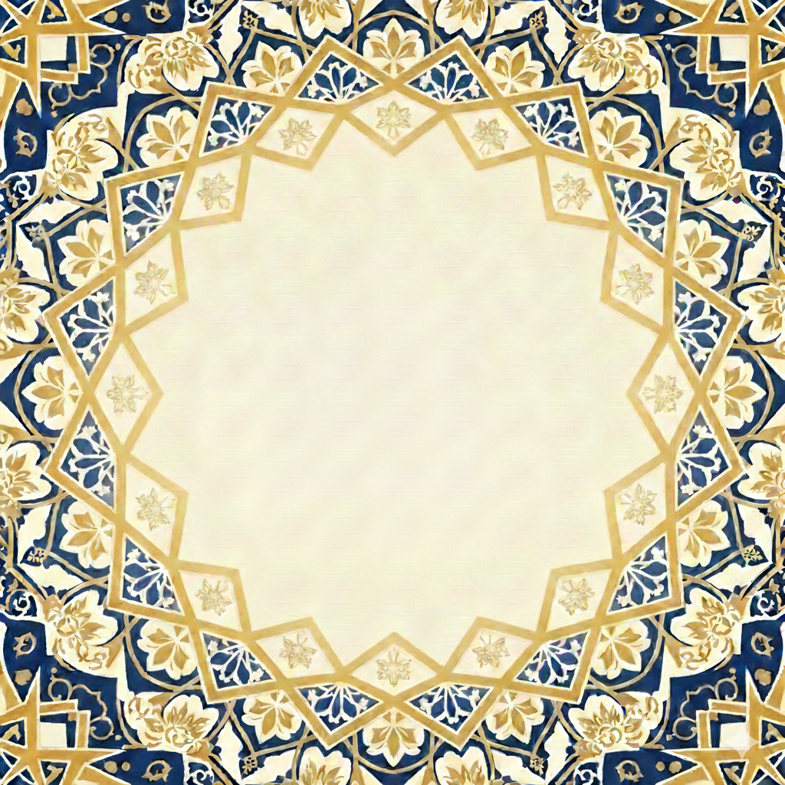

<h1 align="center">
  <br>
  <sub>بسم الله الرحمن الرحيم</sub>
  <br><br>
  
  <br><br>
  Mosque Connect
  <br>
  <sup><sub>صِلَة المسجد</sub></sup>
</h1>

<p align="center">
  <em>A serene, premium mobile experience for local mosque communities.</em>
  <br>
  <em>Prayer times. Announcements. Events. One beautiful app.</em>
</p>

<p align="center">
  
  
  
  
  
</p>

<br>

<p align="center">
  <code>god-tier, not SaaS</code> — rooted in Islamic geometric art and calligraphic tradition
</p>

---

<br>

## The Vision

Most mosque apps feel like an afterthought — generic Material UI shells with hardcoded prayer times and clip-art minarets. **Mosque Connect** is different.

Every pixel draws from centuries of Islamic artistic tradition: the deep blues of İznik tilework, the warm gold of gilded Quranic manuscripts, the terracotta warmth of the Alhambra. Typography pairs classical Arabic Kufic script with refined Latin serifs. Animations breathe with spring physics, never the harsh linearity of factory software.

This is an app your community _deserves_.

<br>

### Splash Screen

<p align="center">
  
</p>

<p align="center">
  <sub>Islamic geometric arabesque — Sacred Blue <code>#1B4965</code> · Divine Gold <code>#C8A951</code> · Warm Ivory <code>#FAF7F2</code></sub>
  <br>
  <sub>Used as the app splash screen, app icon, and adaptive icon across all platforms.</sub>
</p>

<br>

## Features

<table>
<tr>
<td width="50%" valign="top">

### 🕌 Prayer Times  ·  أوقات الصلاة
- Aladhan API with offline adhan-js fallback
- Next prayer countdown with golden glow
- Hijri date display alongside Gregorian
- 5 calculation methods (ISNA, MWL, Umm Al-Qura, Egyptian, Karachi)
- Pull-to-refresh, cached for offline use

</td>
<td width="50%" valign="top">

### 📢 Announcements  ·  إعلانات
- Real-time feed via PocketBase subscriptions
- Urgent announcements pinned with terracotta badge
- Multi-mosque support — see updates from all your communities
- Bismillah empty state (not a sad face icon)

</td>
</tr>
<tr>
<td width="50%" valign="top">

### 📅 Events & Lessons  ·  الفعاليات والدروس
- Calendar + list view toggle
- 6 category filters with color-coded badges
- Speaker, time, location, recurring indicators
- Tap to expand, add to device calendar

</td>
<td width="50%" valign="top">

### ⚙️ Settings  ·  الإعدادات
- GPS location detection for accurate prayer times
- Per-mosque notification preferences
- Reminder timing: at athan, 5/10/15/30 min before
- 12h/24h time format, dark mode, RTL-ready

</td>
</tr>
</table>

<br>

## Design System

> _"Geometry is the language in which God has written the universe."_

### Palette — From Islamic Architectural Tradition

```
  ┌─────────────────────────────────────────────────────────────┐
  │                                                             │
  │   ██████  Warm Ivory      #FAF7F2   Aged parchment         │
  │   ██████  Sacred Blue     #1B4965   İznik tilework          │
  │   ██████  Divine Gold     #C8A951   Gilded manuscripts      │
  │   ██████  Paradise Green  #2D6A4F   Garden of paradise      │
  │   ██████  Terracotta      #C44536   Alhambra clay           │
  │   ██████  Deep Charcoal   #2B2D42   Calligraphic ink        │
  │   ██████  Soft Stone      #E8E4DE   Carved marble           │
  │                                                             │
  │   Dark Mode                                                 │
  │   ██████  Night Sky       #0D1117                           │
  │   ██████  Muted Gold      #B8952E                           │
  │   ██████  Soft White      #E6E1D8                           │
  │                                                             │
  └─────────────────────────────────────────────────────────────┘
```

### Typography

| Context | Arabic | Latin |
|---------|--------|-------|
| **Headings** | Reem Kufi — geometric Kufic | Playfair Display — editorial serif |
| **Body** | Noto Naskh Arabic — elegant naskh | Source Serif 4 — warm readability |
| **Numbers** | Tabular lining figures | System monospace |

### Depth — Muqarnas-Inspired 3-Tier System

```
  ╔══════════════════════════════╗  ← Floating    shadow 0 8 24  (modals, active prayer)
  ║                              ║
  ║   ┌──────────────────────┐   ║  ← Elevated   shadow 0 2 8   (cards, inputs)
  ║   │                      │   ║
  ║   │   ░░░░░░░░░░░░░░░░   │   ║  ← Ground     no shadow      (background, dividers)
  ║   │                      │   ║
  ║   └──────────────────────┘   ║
  ║                              ║
  ╚══════════════════════════════╝
```

### Spacing — 8pt Grid, Generous Whitespace

```
  xs ·    4px   Inline icon gaps
  sm ··   8px   Tight element spacing
  md ···  16px  Default padding
  lg ···· 24px  Section spacing
  xl ····· 32px  Screen padding
  2xl ······ 48px  Section separation
  3xl ······· 64px  Major visual breaks
```

> 30–50% more padding than typical apps. Let the content breathe.

<br>

## Architecture

```
                    ┌──────────────────────────┐
                    │     Digital Ocean         │
                    │     (via Coolify)         │
                    │                          │
                    │  ┌────────────────────┐  │
                    │  │    PocketBase       │  │
                    │  │    ─────────        │  │
                    │  │    SQLite DB        │  │
                    │  │    Auth & Realtime  │  │
                    │  │    REST API         │  │
                    │  │    Admin UI         │  │
                    │  │    Push hooks (JS)  │  │
                    │  └────────┬───────────┘  │
                    │           │ :8090        │
                    └───────────┼──────────────┘
                                │
                        HTTPS   │   Let's Encrypt
                                │
              ┌─────────────────┴──────────────────┐
              │          Mosque Connect App          │
              │                                      │
              │  ┌────────┐ ┌────────┐ ┌──────────┐ │
              │  │ Prayer │ │ Announ │ │  Events  │ │
              │  │ Times  │ │ cements│ │ /Lessons │ │
              │  └───┬────┘ └───┬────┘ └────┬─────┘ │
              │      │          │           │        │
              │  ┌───┴──────────┴───────────┴─────┐ │
              │  │       Service Layer             │ │
              │  │                                 │ │
              │  │  Aladhan API → Prayer Times     │ │
              │  │  adhan-js   → Offline Fallback  │ │
              │  │  PocketBase → Data & Realtime   │ │
              │  │  AsyncStorage → Offline Cache   │ │
              │  │  Expo Notifs → Reminders        │ │
              │  └─────────────────────────────────┘ │
              └──────────────────────────────────────┘
```

<br>

## Tech Stack

| Layer | Choice | Why |
|-------|--------|-----|
| **Framework** | React Native + Expo SDK 55 | Single codebase, managed workflow, OTA updates |
| **Navigation** | Expo Router | File-based routing, deep links, typed routes |
| **Backend** | PocketBase (self-hosted) | One Go binary, SQLite, realtime, auth, admin UI |
| **Prayer Times** | Aladhan API + adhan-js | API when online, local calculation when offline |
| **Notifications** | Expo Notifications | Abstracts FCM/APNs, local scheduling |
| **Storage** | AsyncStorage | Offline-first caching layer |
| **Animations** | Reanimated | 60fps spring physics on the UI thread |
| **Dates** | date-fns | Lightweight, tree-shakeable formatting |
| **Language** | TypeScript (strict) | Zero `any` types, full inference |

<br>

## Project Structure

```
mosque-connect/
├── app/                          # Expo Router — file-based screens
│   ├── _layout.tsx               # Root layout (themes, fonts, splash)
│   ├── +not-found.tsx            # 404 screen
│   └── (tabs)/                   # Bottom tab navigator
│       ├── _layout.tsx           # Tab bar configuration
│       ├── index.tsx             # ☪ Prayer Times (home)
│       ├── announcements.tsx     # 📢 Community announcements
│       ├── events.tsx            # 📅 Events & lessons calendar
│       └── settings.tsx          # ⚙ Preferences & mosque selection
│
├── lib/                          # Core services
│   ├── pocketbase.ts             # Backend client (auth, CRUD, realtime)
│   ├── prayer.ts                 # Aladhan API + adhan-js calculation
│   ├── notifications.ts          # Push tokens, prayer reminders
│   └── storage.ts                # AsyncStorage cache layer
│
├── hooks/                        # React hooks
│   ├── usePrayerTimes.ts         # Prayer data, countdown, Hijri date
│   ├── useAnnouncements.ts       # Feed + realtime subscription
│   └── useEvents.ts              # Events + category filtering
│
├── constants/                    # Design tokens
│   ├── Colors.ts                 # Islamic palette (light + dark)
│   └── Theme.ts                  # Spacing, elevation, typography, springs
│
├── types/                        # TypeScript definitions
│   └── index.ts                  # Mosque, Announcement, Event, Prayer types
│
├── assets/                       # Static resources
│   ├── fonts/                    # SpaceMono (+ Arabic/serif fonts to add)
│   └── images/                   # App icons, splash screen
│
├── BUILD_PROMPT.md               # Comprehensive build specification
├── ARCHITECTURE.md               # Backend, deployment, push notifications
├── CLAUDE.md                     # AI development conventions
└── .env.example                  # Environment template
```

<br>

## Getting Started

### Prerequisites

- [Node.js](https://nodejs.org/) 18+
- [Expo CLI](https://docs.expo.dev/get-started/installation/) (`npx expo`)
- iOS Simulator (macOS) or Android Emulator, or Expo Go on a physical device

### Installation

```bash
# Clone the repository
git clone https://github.com/Masjid-Connect/Masjid-Connect.git
cd Masjid-Connect

# Install dependencies
npm install

# Copy environment config
cp .env.example .env
```

### Development

```bash
# Start the dev server
npx expo start

# Or target a specific platform
npx expo start --ios
npx expo start --android
npx expo start --web

# Clear cache if needed
npx expo start --clear
```

### Type Checking

```bash
npx tsc --noEmit
```

<br>

## Environment Variables

| Variable | Description | Default |
|----------|-------------|---------|
| `EXPO_PUBLIC_POCKETBASE_URL` | Your PocketBase instance URL | `https://pb.mosqueconnect.app` |

<br>

## Prayer Time Calculation

Mosque Connect uses a two-tier approach to ensure prayer times are always available:

```
┌─────────────────────────────────────────────────┐
│  1. Aladhan API  (primary, when online)         │
│     GET /v1/timings/{date}                      │
│     ?latitude={lat}&longitude={lng}&method={m}  │
│     → Accurate times + Hijri date               │
├─────────────────────────────────────────────────┤
│  2. adhan-js     (fallback, always available)   │
│     Local calculation from GPS coordinates      │
│     → Works offline, no network required        │
└─────────────────────────────────────────────────┘
```

**Supported calculation methods:**

| Method | Code | Common In |
|--------|------|-----------|
| ISNA | 2 | North America |
| Muslim World League | 3 | Europe, Far East |
| Umm Al-Qura | 4 | Saudi Arabia |
| Egyptian | 5 | Africa, Middle East |
| Karachi | 1 | Pakistan, South Asia |

<br>

## Offline-First Philosophy

> _The app should work in a basement with no signal just as well as on fiber._

1. **Prayer times** — calculated locally via adhan-js; never depend on network
2. **Cache everything** — announcements and events stored in AsyncStorage with date stamps
3. **Stale is better than empty** — show cached data with a "Last updated" indicator
4. **Queue and sync** — subscription changes queue locally, sync when connectivity returns

<br>

## Backend — PocketBase Collections

<details>
<summary><strong>View full schema</strong></summary>

<br>

**`mosques`** — Registered mosque profiles
```
id, name, address, city, state, country,
latitude, longitude, calculation_method,
jumua_time, contact_phone, contact_email, website, photo
```

**`announcements`** — Community updates
```
id, mosque→, title, body, priority (normal|urgent),
published_at, expires_at, author→users
```

**`events`** — Lessons, lectures, community events
```
id, mosque→, title, description, speaker,
event_date, start_time, end_time, location,
recurring (null|weekly|monthly),
category (lesson|lecture|quran_circle|youth|sisters|community),
author→users
```

**`user_subscriptions`** — Per-mosque notification preferences
```
id, user→, mosque→,
notify_prayers, notify_announcements, notify_events,
prayer_reminder_minutes (default: 15)
```

**`push_tokens`** — Device push notification tokens
```
id, user→, token (Expo push token), platform (ios|android)
```

**`mosque_admins`** — Admin access control
```
id, mosque→, user→, role (admin|super_admin)
```

</details>

<br>

## Design Principles

| Principle | Implementation |
|-----------|---------------|
| **God-tier, not SaaS** | No generic Material/iOS chrome. Custom Islamic aesthetic throughout. |
| **Breathe** | 30–50% more whitespace than typical apps. Content first. |
| **Spring physics** | Reanimated springs (damping 15–20). Never linear easing. |
| **Meaningful motion** | Active prayer card lifts and glows as time approaches. |
| **Haptic vocabulary** | Light tap for nav, medium for prayer alert, heavy for urgent. |
| **RTL-native** | Built for Arabic from day one. Layouts flip automatically. |
| **Offline-first** | Always functional. Network is a bonus, not a requirement. |

<br>

## Roadmap

- [x] Expo project scaffold with TypeScript
- [x] Islamic design system (colors, spacing, elevation, typography)
- [x] Prayer times screen with Aladhan API + adhan-js
- [x] Announcements feed with realtime support
- [x] Events calendar with category filters
- [x] Settings (location, method, reminders, time format)
- [x] PocketBase client with full CRUD
- [x] Push notification infrastructure
- [x] Offline-first storage layer
- [ ] Custom Arabic/serif font loading (Reem Kufi, Playfair Display)
- [ ] Islamic geometric pattern SVG backgrounds
- [ ] PocketBase deployment on Coolify
- [ ] User authentication flow (sign up / sign in)
- [ ] Mosque search & nearby detection
- [ ] Admin panel for mosque managers
- [ ] Notification sound customization (oud, ney, riq)
- [ ] i18n (English ↔ Arabic)
- [ ] EAS Build for TestFlight & Play Store

<br>

## Contributing

Contributions are welcome and deeply appreciated. Whether you're fixing a typo or building a major feature, you're helping mosques serve their communities better.

```bash
# Create a feature branch
git checkout -b feature/your-feature-name

# Make your changes, then
npx tsc --noEmit          # Ensure no type errors
git commit -m "Add meaningful description"
git push origin feature/your-feature-name
```

<br>

## License

MIT — free for all mosques, everywhere.

<br>

---

<p align="center">
  <sub>Built with ❤️ for the ummah</sub>
  <br>
  <sub>اللهم تقبل منا</sub>
</p>
